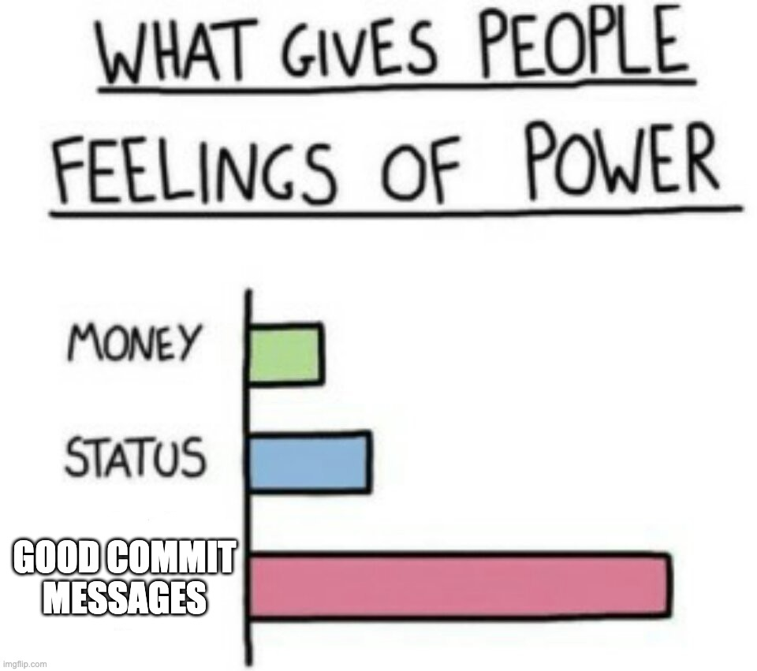

<div style="center">


# ✍🏻 kermit

Commit good code, but what about good committing?

Introducing `/kermit` , a Claude skill that uses [Conventional Commits](https://www.conventionalcommits.org/), prefixes with emojis, and manages a changelog automatically via hooks.

Lightweight, easy to use, saves you about ~10s.

</div>

## ⬇️ Installation

**npm (recommended)**

```bash
npx kermit-msg
```

Or install globally:

```bash
npm install -g kermit-msg
kermit-msg
```

**macOS / Linux (manual)**

```bash
git clone https://github.com/andychan/kermit.git
cd kermit
chmod +x install.sh
./install.sh
```

**Windows (PowerShell)**

```powershell
git clone https://github.com/andychan/kermit.git
cd kermit
.\install.ps1
```

All methods copy `SKILL.md` and `refs/` into `~/.claude/skills/kermit/`.

## 🌟 How to use

In any Claude Code session, invoke the skill:

```
/kermit
```

Or describe what you want:

> "commit this", "make a commit", "commit my changes"

### Initialize changelog

Run once per repo to create `CHANGELOG.md`:

```
/kermit --init
```

## ✨ How it works

1. Reads your staged diff
2. Writes a commit message — emoji prefix, Conventional Commits type and scope, short imperative subject, one bullet per changed file in the body, and a `BREAKING CHANGE` footer if needed
3. Shows you the message and asks to approve or revise. Pick a revision hint (more explicit, less vague, fix linting, etc.) or just describe what you want — it rewrites and comes back
4. Asks whether to run `git commit` for you. Say no and it stops; you keep the message and commit manually
5. On commit, appends an entry to `CHANGELOG.md` with the date, a short summary, and the files touched

### Changelog management

The first time you run `/kermit` in a repo, it checks `.claude/kermit/pref.json`. If the skill hasn't been set up yet, it walks you through changelog initialisation before doing anything else.

You get two options:

- **Create a new changelog** — kermit creates `CHANGELOG.md` for you. If the repo already has commits, it asks whether to backfill them as a `## History` section (one `- date — subject` line per commit) or leave the slate clean.
- **I already have a changelog** — kermit scans the repo for an existing changelog file. If it finds one, it uses it. If it can't find anything, it asks whether to create one or let you provide the path.

The result is stored in `.claude/kermit/pref.json` so the setup prompt never appears again.

## Requirements

- Git
- (Optional) [rtk](https://github.com/rtk-ai/rtk) for token-optimized git commands. Saves lots of tokens.
