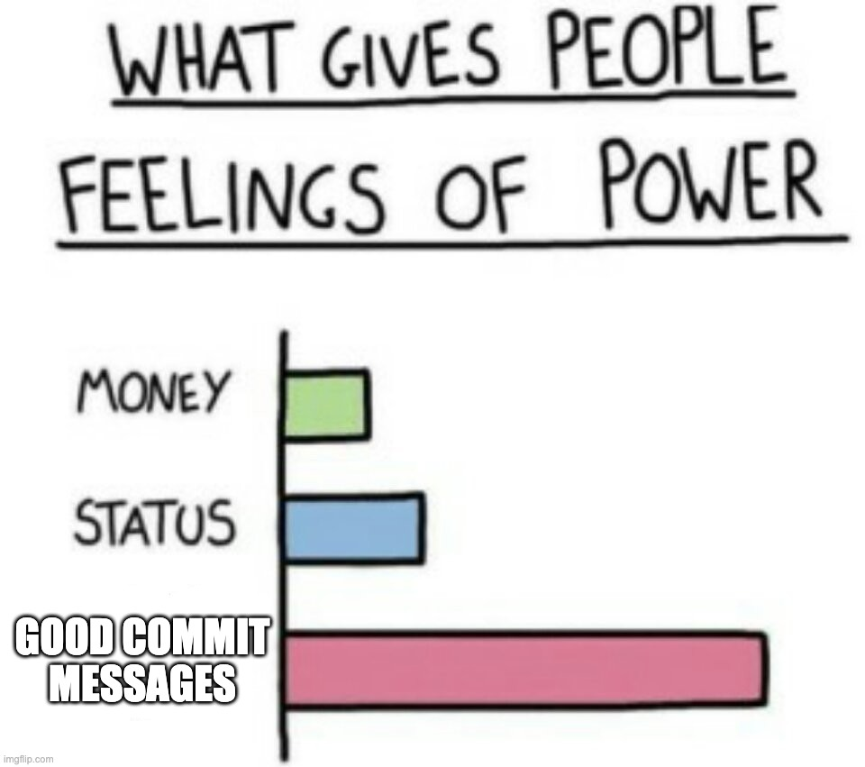
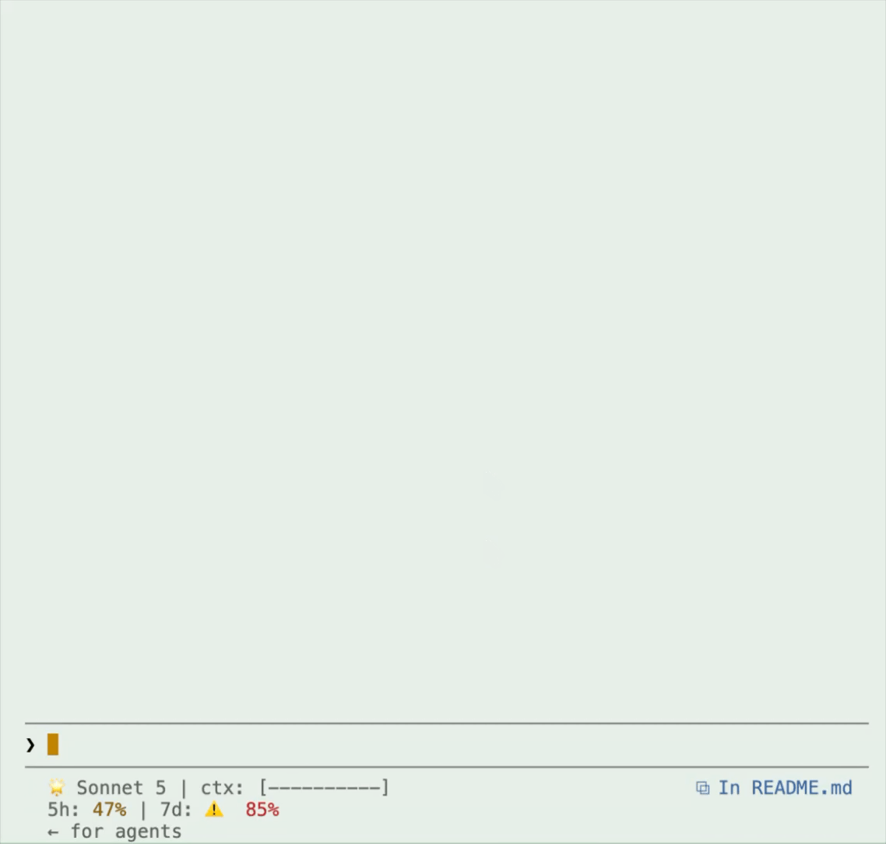
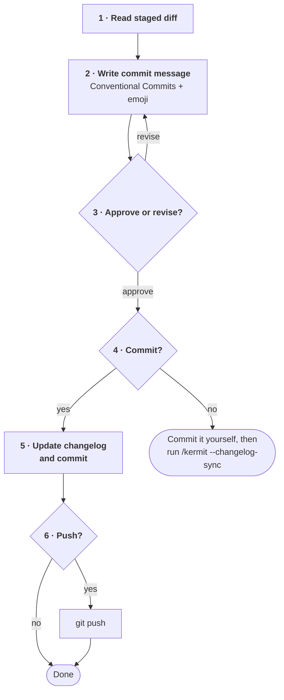

<div align="center"><pre>
██╗  ██╗███████╗██████╗ ███╗   ███╗██╗████████╗
██║ ██╔╝██╔════╝██╔══██╗████╗ ████║██║╚══██╔══╝
█████╔╝ █████╗  ██████╔╝██╔████╔██║██║   ██║   
██╔═██╗ ██╔══╝  ██╔══██╗██║╚██╔╝██║██║   ██║   
██║  ██╗███████╗██║  ██║██║ ╚═╝ ██║██║   ██║   
╚═╝  ╚═╝╚══════╝╚═╝  ╚═╝╚═╝     ╚═╝╚═╝   ╚═╝   
</pre></div>

<div align="center">

### Commit good code, but what about good committing?

<sub>Lightweight opinionated conventional commit style with emoji prefixes, in-built changelog, pull requests, release notes, and breaking change emission. </sub>

<br />



<br />
<br />



<br />

</div>

<p align="center">
  <a href="LICENSE.md"></a>
  
  <a href="https://github.com/ndisisnd/kermit/stargazers"></a>
</p>

<p align="center">
  <a href="#install">Install</a> ·
  <a href="#how-it-works">How it works</a> ·
  <a href="#faq">FAQ</a> ·
  <a href="llms.txt">llms.txt</a>
</p>

<div align="center">

**One command. Intelligent, automated committing.** One-time setup for you to automate commit messages.

<sub>Agents landing here: start with <a href="./llms.txt">llms.txt</a>.</sub>

</div>

---

<a id="install"></a>

## Get started in 30 seconds

### 1. Install the skill
Installing gets you the `kermit` skill and its relevant references. On any platform — macOS, Linux, or Windows — paste this in your terminal:

```bash
npx skills add ndisisnd/kermit -g
```

`-g` installs kermit once for every project, at `~/.claude/skills/kermit`. Drop it and kermit installs into the current repo only, at `./.claude/skills/kermit`.

**On macOS / Linux** you can use the install script instead, which always installs for every project:

```bash
curl -fsSL https://raw.githubusercontent.com/ndisisnd/kermit/main/install.sh | bash
```

Either way, check it landed — you should see `SKILL.md`, `refs/`, and `hooks/`:

```bash
ls ~/.claude/skills/kermit
```

### 2. Initialise kermit
`kermit` can be used immediately, but initialising it would make the experience more seamless and personalised to your codebase + repository. Paste ```bash /kermit --init``` in your terminal. Initialising will run a step-by-step protocol that basically:

1. Determines how you want to manage your changelog, personalised to your style
2. Sets up your release notes (`RELEASES.md`) and, optionally, the merge-to-main guard
3. Determines how you want to gate your commits (e.g. auto-commit, auto-approve, or even commit to push immediately)
4. Saves all your preferences in a JSON file that's used by future `/kermit` runs

_If you already have a changelog, `kermit` will ask you to point to the relative path._

<a id="how-it-works"></a>

## How does it work?

This is the default flow — what you get when you run `/kermit` with no flags.


```mermaid
flowchart TD
    diff["<b>1 · Read staged diff</b>"]
    msg["<b>2 · Write commit message</b><br/>Conventional Commits + emoji"]
    approve{"<b>3 · Approve or revise?</b>"}
    commit{"<b>4 · Commit?</b>"}
    write["<b>5 · Update changelog<br/>and commit</b>"]
    push{"<b>6 · Push?</b>"}
    pushed["git push"]
    manual(["Commit it yourself, then<br/>run /kermit --changelog-sync"])
    done(["Done"])

    diff --> msg
    msg --> approve
    approve -->|revise| msg
    approve -->|approve| commit
    commit -->|no| manual
    commit -->|yes| write
    write --> push
    push -->|yes| pushed
    push -->|no| done
    pushed --> done
```

kermit reads your staged diff — if you didn't stage anything, your LLM will tell you to stage your changes first. It writes the message from the inbuilt protocols, then hands it to the gate mode you selected during `--init`. The gate mode decides which of steps 3, 4 and 6 actually stop to ask you: `full` asks at all three, `auto` asks only for approval, `flash` asks nothing and pushes, and `commit-only` commits without ever pushing.

## Who is this for?
- You **don't like spending time** thinking about how to write commit messages
- Your **commit messages would be challenging to write** because of huge code changes
- You want to make sure **commit messages** are always accurate and representative

## How does `kermit` fit into your harness or workflow?
- You can ask Claude / Codex / Cursor / LLM of your choice to write `kermit` as a hook or automate it when an agent is done coding
- Use `kermit`'s changelog as a way to debug and provide context for agents

`kermit` isn't a competitor to other commit messaging skills: it preserves maximum context with minimal token usage for codebase health.

## How to use

In any session when you want to commit, just run `/kermit` in the terminal. You can also say it in natural language like _make a commit, commit changes, commt this_ and it'll work.

The same goes for pull requests — run `/kermit --pr`, or just say _open a PR_, _raise a pull request to `develop`_, and kermit routes to PR mode automatically (naming a base branch sets the PR base).

### Flags

| Flag | What it does |
|------|--------------|
| `--changelog-reset [--apply]` | Rewrite an existing changelog to the latest conventions — adds `## [N]` numbering and normalises headings/dates/bullets. Backs up to `CHANGELOG.md.bak`, shows a diff, and asks before writing (`--apply` skips the confirm), then exits |
| `--changelog-sync` | Find commits that landed without a changelog entry — you committed by hand, or a session ended early — report them, and backfill the missing entries. Writes only the changelog; it makes no commit |
| `--init` | Re-run the full setup (changelog + release notes + commit gating), then exit |
| `--pr` | Open — or update — a GitHub pull request for the current branch via `gh`. Operates on commits already on the branch (it doesn't create a commit), writes a Conventional-Commits title and a structured body, and shows the PR URL |
| `--release` | Write user-facing **release notes** to `RELEASES.md` for everything since the last release — grouped by type, in plain language — then commit them with a `package.json` version bump and publish a tagged GitHub release via `gh` |

### Changelog numbering

Entries are grouped under a `## <date>` section per day, and each gets a sequential number — `### [1]`, `### [2]`, … — one per commit, with the newest at the top carrying the highest number. Releases don't touch the changelog: kermit remembers which entry number it last shipped, so `--release` picks up exactly where the previous release left off and writes the story to `RELEASES.md` instead.

Bringing an older changelog up to this format? Run `/kermit --changelog-reset` — it numbers and normalises the existing entries in place (after a backup and a diff you approve).

Committed something without an entry — by hand, or a session that ended before kermit finished? Run `/kermit --changelog-sync` (or say _"check my changelog"_, _"log missing commits"_). It compares your history against what the changelog already covers, shows you the commits that are missing, and backfills them — numbering from where kermit left off. It writes the changelog and stops there; committing it is up to you.

### Pull requests

`/kermit --pr` opens or updates a GitHub pull request for whatever branch you're on. It works on the commits already on the branch — it doesn't make a commit, so run `/kermit` first if you have uncommitted work. kermit reads the branch state, pushes the branch if needed, and writes:

- a **title** in Conventional Commits style that summarises the branch's overall intent, and
- a **body** with `## Summary`, `## Why this is being made`, `## Specific changes` (one bullet per distinct change, keyed by module/file), and an optional `## Additional information`.

It defaults the base to your repo's default branch, or the one you name (_"open a PR to `develop`"_). If a PR already exists for the branch, kermit edits it in place instead of opening a duplicate. Approval follows the same gate mode you set during `--init`. Requires the GitHub CLI, authenticated (`gh auth login`).

### Release notes

`CHANGELOG.md` is written for the people building the software — one numbered entry per commit, with the files that changed. **Release notes** are written for the people _using_ it. Run `/kermit --release` (or say _"cut a release"_, _"write release notes"_) and kermit reads every change since your last release and rewrites it into `RELEASES.md`: a highlight summary up top, then changes grouped by type — **✨ New**, **📈 Improved**, **🐛 Fixed**, **🔒 Security**, **⚠️ Breaking**, **🗑️ Deprecated**.

The notes focus on you, not the diff — what you can now do, what changed for you, and why — in plain language, no file names or jargon. It's the same spirit as the [Linear](https://linear.app/changelog) and [Notion](https://www.notion.com/releases) changelogs. `--init` scaffolds `RELEASES.md` for you (and can draft an inaugural note from your history), and approval follows the gate mode you set during setup.

Once you approve the notes, kermit finishes the release for you: it bumps your `package.json` version, commits both files as `🔖 chore(release): vX.Y.Z`, pushes, and publishes a tagged GitHub release with those same notes as the body. The release commit deliberately gets no changelog entry — it's bookkeeping, not a change your users need to read about next time. Each step follows your gate mode, so `full` asks before committing and before publishing, while `flash` does the lot. Publishing needs the GitHub CLI authenticated (`gh auth login`); without it, kermit still writes and commits the notes and tells you the one command to publish yourself.

**Automatic prompt on merge to main.** A release is a formal moment — usually a branch landing on `main`. If you enable the **merge-to-main guard** during `--init`, kermit watches for a merge or push to `main` and reminds you to write release notes first, warning you if you skip them (so a release never ships silently). The guard is a local hook — it prompts, it never blocks your merge.

## How to update

If you installed with the skills CLI, update kermit by name:

```bash
npx skills update kermit
```

If you used the install script, updating is that same line again:

```bash
curl -fsSL https://raw.githubusercontent.com/ndisisnd/kermit/main/install.sh | bash
```

The install script wipes `~/.claude/skills/kermit` before it writes, so refs retired or renamed in a newer version don't linger. Your settings are safe either way: they live in each project's `.claude/kermit/` directory, which neither path touches. That means you don't re-run `/kermit --init` after an update unless you want to change your answers.

To bring files kermit already wrote up to the current conventions, run `/kermit --changelog-reset` — it renumbers and normalises an existing `CHANGELOG.md` in place, after a backup and a diff you approve.

<a id="faq"></a>

## FAQ

**Do I need the GitHub CLI?**
Only for the parts that talk to GitHub. Committing and changelogs work with plain git. `--pr` needs `gh` authenticated (`gh auth login`), and `--release` needs it to publish the tagged release — without it, kermit still writes and commits your release notes and tells you the one command to publish yourself.

**What's the difference between `CHANGELOG.md` and `RELEASES.md`?**
Who they're for. The changelog is for the people building the software: one numbered entry per commit, naming the files that changed. Release notes are for the people using it: what you can now do and why it matters, in plain language, grouped by type. Releases never touch the changelog.

**Will kermit commit without asking me?**
That's your choice, set once during `--init` and reused by every mode. The gate modes run from `full` (asks before each step) through to `flash` (writes, commits, and pushes without stopping). If you never run `--init`, kermit asks.

**I already have a changelog. Will it get overwritten?**
No. `--init` asks you to point at the existing file rather than replacing it. If you want it reformatted to kermit's conventions, `--changelog-reset` is the explicit way — and it backs up to `CHANGELOG.md.bak` and shows you a diff before writing anything.

**Does the merge-to-main guard block my merge?**
No. It's a local hook that prompts you to write release notes when a branch lands on a protected branch, and warns you if you skip. It never blocks the merge itself.

## License

[MIT](LICENSE.md)

## Acknowledgements

- [rtk](https://github.com/rtk-ai/rtk) for token-optimized git commands. Saves lots of tokens
- [Conventional Commits](https://www.conventionalcommits.org/en/v1.0.0/) for the open-sourced scaffold of commit messages
